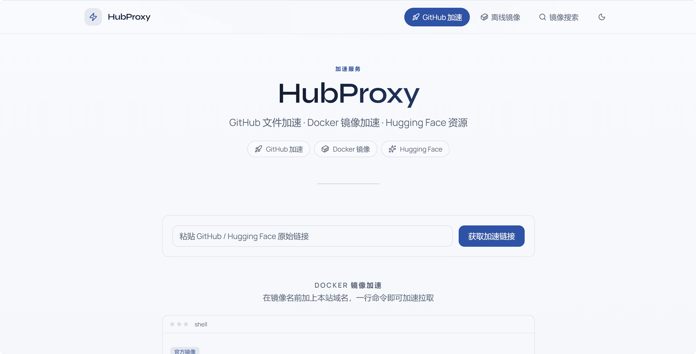

# HubProxy

 **Docker 和 GitHub 加速代理服务器**

一个轻量级、高性能的多功能代理服务，提供 Docker 镜像加速、GitHub 文件加速、下载离线镜像、在线搜索 Docker 镜像等功能。


<p align="center">
  
</p>


## 特性

- 🐳 **Docker 镜像加速** — 兼容 Registry API v2，支持 Docker Hub、GHCR、Quay、GCR、registry.k8s.io；流式传输，Manifest / Token 缓存
- 📦 **离线镜像包** — 无需本地 Docker，在线打包单镜像或批量 tar；流式下载 + 防抖设计
- 📁 **GitHub 文件加速** — Release、Raw、Git Clone、`api.github.com`；`.sh` / `.ps1` 脚本内 URL 自动改写
- 🤖 **Hugging Face 加速** — 模型文件与 LFS 大文件下载
- 🔍 **镜像搜索** — Web 界面与 API 搜索 Docker Hub 镜像、浏览标签
- 🛡️ **智能限流** — 按真实客户端 IP 令牌桶限流（IPv6 按 `/64`）；可配置周期与配额
- 🚫 **仓库访问控制** — IP 黑白名单（限流豁免 / 封禁）+ 镜像 / GitHub 仓库黑白名单，支持通配符
- 🌐 **上游 SOCKS5 代理** — 可选配置出站代理，适配特殊网络环境
- 🖥️ **Web 界面** — 内置 Vue SPA，镜像搜索、离线包下载、标签浏览
- ⚡ **轻量高效** — Go 单二进制，支持 `deb` / `rpm` / `apk` 与 Docker 多架构镜像
- 🔧 **统一配置** — `config.toml` + 环境变量覆盖，开箱即用
- 🚀 **多服务统一加速** — 单个程序覆盖 Docker、GitHub、Hugging Face，简化部署
- ☁️ **完全自托管** — 不依赖第三方免费 CDN 代理，数据与带宽自主可控

## 快速开始

### Docker 部署（推荐）

```bash
docker run -d \
  --name hubproxy \
  -p 5000:5000 \
  --restart always \
  ghcr.io/sky22333/hubproxy
```

验证服务：

```bash
curl http://127.0.0.1:5000/ready
```

或者网页访问

### 脚本安装

自动识别 `amd64` / `arm64` 与 `apt`、`dnf`、`apk` 等包管理器：

```bash
curl -fsSL https://raw.githubusercontent.com/sky22333/hubproxy/main/install.sh | sh
```

安装后配置文件位于 `/etc/hubproxy/config.toml`，服务自动启动。

### 快速上手

将 `yourdomain.com` 换成你的 `HubProxy` 地址
```bash
# Docker 镜像加速
docker pull yourdomain.com/nginx

# GitHub Release 加速
wget "https://yourdomain.com/https://github.com/owner/repo/releases/download/v1.0.0/app.tar.gz"

# Git clone 加速
git clone https://yourdomain.com/https://github.com/sky22333/hubproxy.git
```

> **生产环境建议**：绑定自有域名，通过 Caddy / Nginx 反代并开启 HTTPS，不要长期暴露裸 `http://IP:5000`。详见 [文档](https://docs.52013120.xyz/getting-started/quick-start/)。

## 详细文档

部署架构、完整配置、K8s / NAS、传输特性与 FAQ 见官方文档站：

- [**中文文档**](https://docs.52013120.xyz/)
- [**English**](https://docs.52013120.xyz/en/)


## 界面预览



## 免责声明

- 本程序仅供学习交流使用，请勿用于非法用途
- 使用本程序需遵守当地法律法规
- 作者不对使用者的任何行为承担责任

---

**如果这个项目对你有帮助，请给个 Star ⭐**
